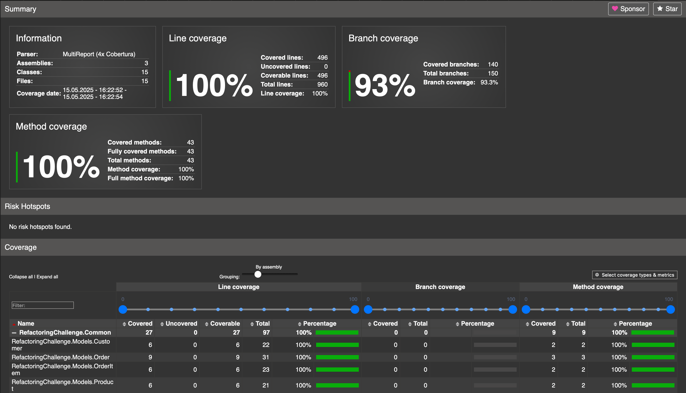

# Refactoring Challenge - Solution

This project demonstrates the refactoring of a monolithic application into a more maintainable and testable architecture using SOLID principles, clean architecture concepts, and modern design patterns. The refactoring transforms a tightly-coupled, hard-to-test codebase into a modular, well-structured solution with clear separation of concerns.

## Key Refactoring Goals Achieved
- Separated business logic from data access
- Introduced proper interface abstractions
- Organized code into logical projects
- Added comprehensive testing
- Implemented internationalization support
- Improved maintainability and extensibility

## Implemented Refactorings

### 1. Repository Pattern
The data access layer has been separated from the business logic using the Repository pattern. Each entity (Customer, Order, Product, Inventory) has its own repository that handles all database operations.

Key repositories:
- `CustomerRepository`: Handles customer data operations
- `OrderRepository`: Manages orders and their items
- `ProductRepository`: Retrieves product information
- `InventoryRepository`: Manages product inventory levels

### 2. Service Layer
Business logic has been moved to dedicated service classes:
- `OrderProcessingService`: Core business logic for processing customer orders
- `DiscountService`: Calculates discounts based on various rules

### 3. Dependency Injection
- Microsoft's built-in DI container is used to register and inject all dependencies
- Each component depends on interfaces rather than concrete implementations
- Follows the Inversion of Control principle for better testability and maintainability

### 4. Unit Testing
- Comprehensive unit tests have been added for business logic
- Mock objects are used to isolate the component under test
- Integration tests demonstrate the full workflow

## Project Structure

```
RefactoringChallenge/
├── RefactoringChallenge.Common/       # Common interfaces and models
│   ├── Models/
│   │   ├── Customer.cs
│   │   ├── Order.cs
│   │   ├── OrderItem.cs
│   │   └── Product.cs
│   ├── Repositories/                  # Repository interfaces
│   │   ├── ICustomerRepository.cs
│   │   ├── IOrderRepository.cs
│   │   ├── IProductRepository.cs
│   │   └── IInventoryRepository.cs
│   └── Services/                      # Service interfaces
│       ├── IOrderProcessingService.cs
│       └── IDiscountService.cs
├── RefactoringChallenge.Orchestration/  # Implementation of business logic
│   ├── Factories/
│   │   ├── ISqlConnectionFactory.cs
│   │   └── SqlConnectionFactory.cs
│   ├── Helpers/
│   │   └── ConnectionStringHelper.cs
│   ├── Repositories/                   # Repository implementations
│   │   ├── CustomerRepository.cs
│   │   ├── OrderRepository.cs
│   │   ├── ProductRepository.cs
│   │   └── InventoryRepository.cs
│   ├── Resources/                      # Localization resources
│   │   ├── LocalizationHelper.cs
│   │   ├── OrderProcessingMessages.resx (English)
│   │   └── OrderProcessingMessages.cs.resx (Czech)
│   └── Services/                       # Service implementations
│       ├── OrderProcessingService.cs
│       └── DiscountService.cs
├── RefactoringChallenge.Output/        # Application entry points
│   ├── New_CustomerOrderProcessor.cs
│   └── Worker.cs
└── RefactoringChallenge.Tests/        # Tests
    ├── Integration/
    │   └── OrderProcessingIntegrationTests.cs
    └── Unit/
        ├── DiscountServiceTests.cs
        └── OrderProcessingServiceTests.cs
```

## Benefits of the Refactoring

1. **Improved Maintainability**: Code is now organized into smaller, focused classes with single responsibilities
2. **Better Testability**: Services and repositories can be easily tested in isolation
3. **Loose Coupling**: Components interact through interfaces, making it easier to change implementations
4. **Separation of Concerns**: Data access logic is separate from business logic
5. **Scalability**: The application is now easier to extend with new features
6. **Modularity**: The code is organized into separate projects by responsibility (Common, Orchestration, Output)
7. **Removed Test Dependencies**: Eliminated SQLite dependency from tests in favor of proper mocking

## Architecture Decisions

### Clean Architecture Approach
The solution follows a clean architecture pattern with clear separation between:
- **Core Domain Models** (RefactoringChallenge.Common/Models)
- **Use Cases/Business Rules** (RefactoringChallenge.Orchestration/Services)
- **External Interfaces** (RefactoringChallenge.Common/Repositories)
- **Infrastructure** (RefactoringChallenge.Orchestration/Repositories)

### Database Access
- Used ADO.NET with proper connection management through the `SqlConnectionFactory`
- Connection strings are managed centrally via `ConnectionStringHelper`
- SQLite in-memory database dependency was removed from tests in favor of proper mocking

## Running the Application

The application is configured as a worker service that processes orders for customers. To run it:

```bash
dotnet run
```

The service will automatically process any pending orders for customers according to the business rules.


## Results

1. Code Coverage

# Run the tests and collect coverage data + Generate HTML report
run `generate-coverage.sh`


## Localization Support
The application has been updated to support multiple languages through resource files (.resx). Currently, the following languages are supported:

- English (default)
- Czech (cs)

To set the culture for the application, you can use the `LocalizationHelper` class:

```csharp
// Set to Czech culture
LocalizationHelper.SetCulture("cs");

// Set back to English culture
LocalizationHelper.SetCulture("en");
```

All user-facing messages from the `OrderProcessingService` are now stored in resource files, making it easy to add support for additional languages.

### Localization Architecture
- Resource files are stored in `RefactoringChallenge.Orchestration/Resources/`
- Base resource file (`OrderProcessingMessages.resx`) contains English strings
- Czech localization is in `OrderProcessingMessages.cs.resx`
- The `LocalizationHelper` handles culture switching and resource loading

To add support for a new language:
1. Create a new resource file with the appropriate culture suffix (e.g., `OrderProcessingMessages.fr.resx` for French)
2. Translate all the string resources
3. The application will automatically use the new language when `LocalizationHelper.SetCulture("fr")` is called

## Testing Strategy

### Test Structure
The tests are organized into two main categories:
- **Unit Tests**: Test individual components in isolation with mocks for dependencies
- **Integration Tests**: Test the interaction between components with a focus on core business workflows

### Testing Best Practices Implemented
1. **Mocking Dependencies**: Using mock objects to isolate the component under test
2. **Arrangement, Action, Assertion Pattern**: Tests clearly separate setup, execution, and verification steps
3. **Descriptive Test Names**: Tests are named to describe the behavior being tested
4. **Test Data Builders**: Helper methods create test data consistently
5. **Coverage Tracking**: Code coverage is tracked to ensure comprehensive test coverage

### Test Coverage

The project includes a code coverage report generated using coverlet and ReportGenerator. To view the coverage report:

```bash
# Run the tests and generate coverage report
./generate-coverage.sh

# Open the coverage report in your browser
open CoverageReport/index.html
```

Current code coverage results:



The coverage report helps identify areas of code that may need additional tests.

## Containerization Support

The application includes Docker support for running both the application and its tests:

- `Dockerfile` - For containerizing the application
- `Tests.Dockerfile` - For running tests in a container
- `docker-compose.yaml` - For orchestrating the application and its dependencies

To run the tests in Docker:
```bash
./run-docker-tests.sh
```

This ensures consistent test execution across different environments and simplifies CI/CD integration.

## Future Improvement Opportunities

While the current refactoring has significantly improved the codebase, there are additional enhancements that could be made:

1. **Advanced Logging**: Implement structured logging with correlation IDs
2. **Database Views**: Transform complex SELECT queries into database views for improved readability and performance
3. **Entity Framework Core**: Replace direct ADO.NET access with Entity Framework Core ORM for simplified data access and better maintainability


## License
This project is licensed under the [MIT License](LICENSE).

